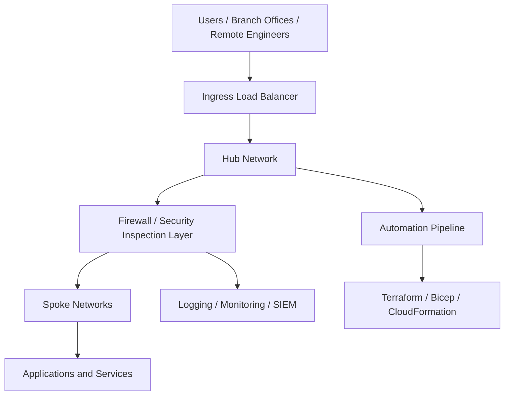

# 🚀 Deloitte Multi-Cloud Security Lab Bootcamp


---

## 👨🏾‍💻 Author
**Olumide Towoju**  
GitHub: [olumidetowoju](https://github.com/olumidetowoju)

---

## 🎯 Course Goal

This repository is a **hands-on, textbook-style, instructor-led multi-cloud security lab bootcamp** designed for the **Cloud Network & Security Engineer** role.

The course is built around real-world enterprise skills used in global consulting environments, with emphasis on:

- **Azure, AWS, and GCP networking**
- **Hub-and-spoke architecture**
- **Cloud-native and vendor firewalls**
- **Load balancers and application delivery**
- **Hybrid connectivity (VPN, ExpressRoute, Direct Connect)**
- **Terraform and Infrastructure as Code**
- **GitHub Actions and Azure DevOps**
- **Operational troubleshooting and incident response**

---

## 🧠 How to Think About This Course

Think of this bootcamp like building and defending a modern international airport:

- **Hub network** = central terminal
- **Spoke networks** = gates and routes
- **Firewall** = security checkpoint
- **Load balancer** = traffic controller
- **VPN / ExpressRoute / Direct Connect** = secure highways and tunnels
- **Terraform** = architectural blueprint
- **CI/CD pipeline** = automated construction crew
- **Logging / monitoring** = security cameras and operations center

This analogy will help you connect cloud security concepts to real-world systems.

---

## 📚 Course Directory

| Day | Topic | Link |
|-----|------|------|
| Day 01 | Foundations & Tooling | [Open](day01-foundations-and-tooling/README.md) |
| Day 02 | Azure Hub-and-Spoke + Firewall | [Open](day02-azure-hub-spoke-firewall/README.md) |
| Day 03 | AWS Transit Gateway + Inspection | [Open](day03-aws-transit-gateway-inspection/README.md) |
| Day 04 | GCP Hub-and-Spoke + Cloud Armor | [Open](day04-gcp-hub-spoke-cloud-armor/README.md) |
| Day 05 | Hybrid Connectivity (VPN / ExpressRoute / Direct Connect) | [Open](day05-hybrid-connectivity-vpn/README.md) |
| Day 06 | Load Balancers & Application Protection | [Open](day06-load-balancers-and-app-protection/README.md) |
| Day 07 | Palo Alto & Check Point Firewalls | [Open](day07-vendor-firewalls-paloalto-checkpoint/README.md) |
| Day 08 | Terraform Multi-Cloud Modules | [Open](day08-terraform-multi-cloud-modules/README.md) |
| Day 09 | CI/CD with GitHub Actions & Azure DevOps | [Open](day09-cicd-github-actions-azure-devops/README.md) |
| Day 10 | Operations, Incident Response & Capstone | [Open](day10-operations-ir-and-capstone/README.md) |

---

## 🧱 Repository Structure

```text
deloitte-multi-cloud-security-lab/
├── README.md
├── docs/
│   ├── architecture/
│   ├── diagrams/
│   ├── runbooks/
│   └── references/
├── day01-foundations-and-tooling/
├── day02-azure-hub-spoke-firewall/
├── day03-aws-transit-gateway-inspection/
├── day04-gcp-hub-spoke-cloud-armor/
├── day05-hybrid-connectivity-vpn/
├── day06-load-balancers-and-app-protection/
├── day07-vendor-firewalls-paloalto-checkpoint/
├── day08-terraform-multi-cloud-modules/
├── day09-cicd-github-actions-azure-devops/
├── day10-operations-ir-and-capstone/
└── assets/
```

---

## 🏗️ High-Level Architecture



---

## ✅ Prerequisites Checklist

Before starting this class, make sure you have:

 Git installed

 GitHub account

 Azure CLI installed

 AWS CLI installed

 Google Cloud CLI installed

 Terraform installed

 VS Code or preferred editor

 Bash or PowerShell familiarity

 Basic networking knowledge (CIDR, subnets, routes, DNS)

 At least one cloud account or sandbox subscription

---

## 🎓 Learning Outcomes

By the end of this bootcamp, you should be able to:

Design enterprise-scale multi-cloud hub-and-spoke architectures

Deploy and troubleshoot cloud-native and vendor firewalls

Implement secure hybrid connectivity

Build and protect application delivery paths

Automate deployments using Terraform

Integrate network security into CI/CD workflows

Create documentation and runbooks like a real consulting engineer

Present a capstone architecture aligned to a Fortune 50 enterprise environment

---

## 📘 Learning Style

This course is intentionally written in a:

Textbook style for depth

Tutor style for explanation

Hands-on lab style for skill building

Interview-oriented style for role preparation

Each day will include:

Concept explanation

Analogy

Architecture discussion

Step-by-step lab

Validation checklist

Troubleshooting notes

Key takeaways

---

## 🚦 Progress Tracker

 Day 01 completed

 Day 02 completed

 Day 03 completed

 Day 04 completed

 Day 05 completed

 Day 06 completed

 Day 07 completed

 Day 08 completed

 Day 09 completed

 Day 10 completed

---

## 🔥 Capstone Outcome

At the end of the course, this repository will contain a complete portfolio-grade multi-cloud network and security engineering lab that demonstrates practical experience in:

Cloud networking

Network security engineering

Firewall operations

Load balancer design

Hybrid connectivity

IaC automation

DevSecOps integration

Enterprise troubleshooting

---

## 📌 Next Step

Start with Day 01:

➡️ Go to Day 01 - Foundations & Tooling
