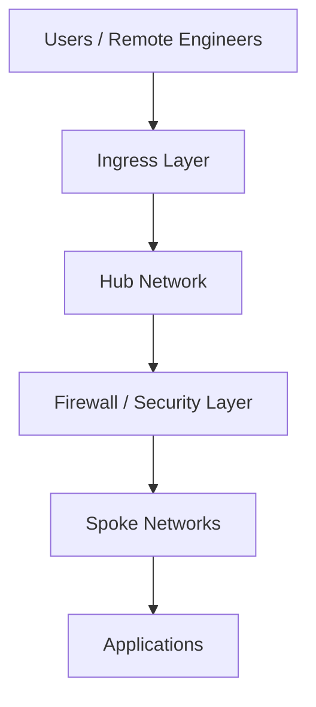
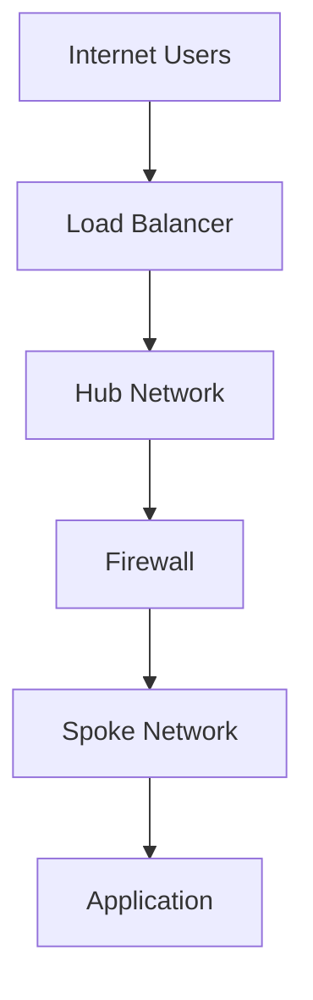

# 📘 Day 01 — Foundations & Tooling

---

## 🎯 Objective

Establish the **foundation layer** for a multi-cloud network security environment.

By the end of this lab, you will:
- Install and verify all required tools
- Authenticate into Azure, AWS, and GCP
- Design a multi-cloud IP addressing plan
- Create a high-level architecture diagram
- Prepare your environment for all future labs

---

## 🧠 Concept (Think Like an Architect)

### 🏙️ Analogy: Building a Secure Smart City

Before deploying anything, think of cloud networking like designing a city:

| Cloud Concept | Real-World Equivalent |
|--------------|----------------------|
| VPC / VNet | City |
| Subnet | Neighborhood |
| Firewall | Security checkpoint |
| Load Balancer | Traffic controller |
| Hub Network | Airport terminal |
| Spoke Network | Roads / routes |
| VPN | Secure tunnel |
| Terraform | Blueprint |

👉 You are not just deploying resources —  
You are designing **controlled, secure traffic flow**.

---

## 🏗️ High-Level Architecture



---

## 🧰 Prerequisites

Ensure you have:

 Ubuntu (WSL2 recommended)

 Git installed

 GitHub account

 Internet access

 Basic networking knowledge (CIDR, subnets, routing)

---

## 🧪 Lab Step 1 — Verify Installed Tools

Run:

```
terraform -v
az version
aws --version
gcloud version
git --version
```

---

## 🔧 Lab Step 2 — Install Missing Tools

```
Install Terraform
sudo apt update
sudo apt install -y unzip
curl -fsSL https://releases.hashicorp.com/terraform/1.9.8/terraform_1.9.8_linux_amd64.zip -o terraform.zip
unzip terraform.zip
sudo mv terraform /usr/local/bin/
Install Azure CLI
curl -sL https://aka.ms/InstallAzureCLIDeb | sudo bash
Install AWS CLI
sudo apt install awscli -y
Install Google Cloud CLI
sudo apt install google-cloud-cli -y
```

---

## 🔐 Lab Step 3 — Authenticate to Cloud Providers
Azure
az login
az account show
AWS
aws configure

Provide:

Access Key

Secret Key

Region: us-east-1

Output: json

Verify:

aws sts get-caller-identity
GCP
gcloud auth login
gcloud config list

---

## 🧠 Key Concept — Identity is the Control Plane

In enterprise environments:

Azure → Entra ID

AWS → IAM / Identity Center

GCP → IAM

👉 If identity is misconfigured, network security fails.

---

## 🌐 Lab Step 4 — Create IP Addressing Plan

Design your network ranges:

Azure Hub:      10.0.0.0/16
Azure Spoke:    10.1.0.0/16

AWS Hub:        10.10.0.0/16
AWS Spoke:      10.11.0.0/16

GCP Hub:        10.20.0.0/16
GCP Spoke:      10.21.0.0/16

🧠 Why This Matters

Prevent overlapping IP ranges

Enable hybrid connectivity later

Support scalable architecture

---

## 🧪 Lab Step 5 — Create Architecture File
nano ../../docs/architecture/day01-architecture.md

Paste:

# Day 01 Architecture



---

## 💾 Save and Push Changes

bash

git add .

git commit -m "Add Day 01 lab"

git push

---

## ✅ Validation Checklist

 - Terraform installed and working
 - Azure CLI authenticated
 - AWS CLI authenticated
 - GCP CLI authenticated
 - IP addressing plan defined
 - Architecture diagram created
 - Changes pushed to GitHub

---

## 🚨 Troubleshooting

Terraform not found:
- terraform -v
- Reinstall if needed
- Azure login issues
- az account show
- AWS authentication failure
- aws sts get-caller-identity
- GCP issues

Ensure:

- Project exists
- Terms accepted

---

## 🎯 Key Takeaways

- Network security = traffic control + inspection
- Identity = true security boundary
- Hub-and-spoke = centralized governance
- Terraform = repeatable infrastructure
- Documentation = engineering maturity

---

## 🚀 Next Step

➡️ Proceed to Day 02 — Azure Hub-Spoke + Firewall

You will:

- Build a hub-and-spoke network
- Deploy Azure Firewall
- Configure routing (UDRs)
- Test secure traffic flow
