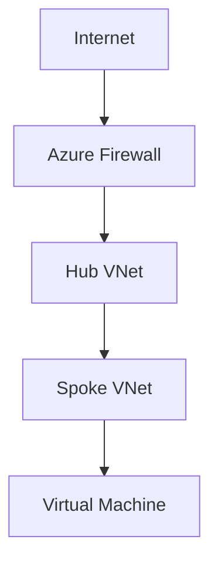

# 📘 Day 02 — Azure Hub-and-Spoke + Firewall

---

## 🎯 Objective

Design and deploy a **secure Azure hub-and-spoke architecture** with centralized traffic inspection using **Azure Firewall**.

By the end of this lab, you will:
- Create Hub and Spoke VNets
- Peer VNets together
- Deploy Azure Firewall
- Configure User Defined Routes (UDRs)
- Force traffic through the firewall
- Validate traffic flow

--- 

## 🧠 Concept (Think Like an Architect)

### ✈️ Analogy: Airport Security Model

- Hub = Airport terminal
- Spokes = Gates
- Firewall = Security checkpoint

👉 ALL passengers (traffic) must go through **security before reaching the gate**

---

## 🏗️ Architecture

---

## 🧱 Lab Architecture Design

| Component | Value |
|-----------|-------|
| Hub VNet | 10.0.0.0/16 |
| Spoke VNet | 10.1.0.0/16 |
| Firewall Subnet | AzureFirewallSubnet |
| Region | eastus |

---

### 🧪 Lab Step 1 — Create Resource Group
az group create \
  --name clab-network-rg \
  --location eastus

### 🌐 Lab Step 2 — Create Hub VNet
az network vnet create \
  --name hub-vnet \
  --resource-group clab-network-rg \
  --address-prefix 10.0.0.0/16 \
  --subnet-name default \
  --subnet-prefix 10.0.1.0/24

### 🌐 Lab Step 3 — Create Spoke VNet
az network vnet create \
  --name spoke-vnet \
  --resource-group clab-network-rg \
  --address-prefix 10.1.0.0/16 \
  --subnet-name default \
  --subnet-prefix 10.1.1.0/24

### 🔗 Lab Step 4 — VNet Peering
Hub → Spoke
az network vnet peering create \
  --name hub-to-spoke \
  --resource-group clab-network-rg \
  --vnet-name hub-vnet \
  --remote-vnet spoke-vnet \
  --allow-vnet-access
Spoke → Hub
az network vnet peering create \
  --name spoke-to-hub \
  --resource-group clab-network-rg \
  --vnet-name spoke-vnet \
  --remote-vnet hub-vnet \
  --allow-vnet-access

### 🔥 Lab Step 5 — Create Azure Firewall Subnet
az network vnet subnet create \
  --resource-group clab-network-rg \
  --vnet-name hub-vnet \
  --name AzureFirewallSubnet \
  --address-prefix 10.0.2.0/24

### 🔥 Lab Step 6 — Deploy Azure Firewall
Create Public IP
az network public-ip create \
  --name fw-pip \
  --resource-group clab-network-rg \
  --sku Standard
Create Firewall
az network firewall create \
  --name clab-firewall \
  --resource-group clab-network-rg
Assign Public IP
az network firewall ip-config create \
  --firewall-name clab-firewall \
  --name fw-config \
  --public-ip-address fw-pip \
  --resource-group clab-network-rg \
  --vnet-name hub-vnet

### 🚦 Lab Step 7 — Create Route Table
az network route-table create \
  --name spoke-rt \
  --resource-group clab-network-rg

➡️ Add Default Route to Firewall

First get firewall private IP:

az network firewall show \
  --name clab-firewall \
  --resource-group clab-network-rg \
  --query "ipConfigurations[0].privateIPAddress" \
  --output tsv

Then:

az network route-table route create \
  --resource-group clab-network-rg \
  --route-table-name spoke-rt \
  --name route-to-firewall \
  --address-prefix 0.0.0.0/0 \
  --next-hop-type VirtualAppliance \
  --next-hop-ip-address <FIREWALL_PRIVATE_IP>
🔗 Associate Route Table with Spoke Subnet
az network vnet subnet update \
  --resource-group clab-network-rg \
  --vnet-name spoke-vnet \
  --name default \
  --route-table spoke-rt

### 🧪 Lab Step 8 — Deploy Test VM (Spoke)
az vm create \
  --resource-group clab-network-rg \
  --name test-vm \
  --vnet-name spoke-vnet \
  --subnet default \
  --image Ubuntu2204 \
  --admin-username azureuser \
  --generate-ssh-keys

### 🧪 Lab Step 9 — Test Traffic Flow

SSH into VM:

ssh azureuser@<VM_PUBLIC_IP>

Run:

curl ifconfig.me

👉 Traffic should flow through firewall (once rules are configured in later labs)

---

## 🚨 Key Concept — Forced Tunneling

👉 The route table ensures:

ALL TRAFFIC → FIREWALL → INTERNET

This is enterprise-grade control.

---

## ✅ Validation Checklist

 Hub VNet created

 Spoke VNet created

 Peering configured

 Azure Firewall deployed

 Route table created

 Traffic forced through firewall

 VM deployed and reachable

---

## 🚨 Troubleshooting

Peering not working
az network vnet peering list -g clab-network-rg
Firewall not getting IP

Check:

az network firewall show -g clab-network-rg -n clab-firewall
Route not applied

Check:

az network route-table show -g clab-network-rg -n spoke-rt
VM cannot access internet

Check NSG rules

Check route table association

Check firewall config

---

## 🎯 Key Takeaways

Hub-and-spoke = centralized security model

Azure Firewall = traffic inspection layer

Route tables = traffic control mechanism

Peering = network connectivity foundation

Forced tunneling = enterprise enforcement

---

## 🚀 Next Step

➡️ Day 03 — AWS Transit Gateway + Centralized Inspection

You will:

Build AWS equivalent architecture

Use Transit Gateway

Implement centralized routing

Compare Azure vs AWS designs
