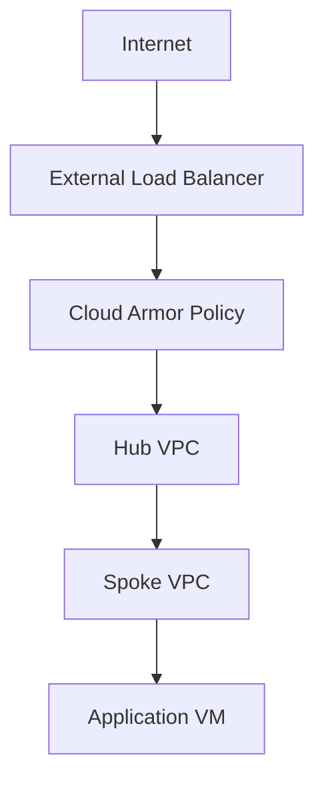

# 📘 Day 04 — GCP Hub-and-Spoke + Cloud Armor

---

## 🎯 Objective

Design and deploy a **GCP hub-and-spoke architecture** with **edge protection using Cloud Armor** and centralized connectivity.

By the end of this lab, you will:
- Create VPC networks
- Build hub-and-spoke topology
- Configure firewall rules
- Deploy a load balancer
- Apply Cloud Armor security policy
- Understand GCP networking model vs Azure and AWS

---

## 🧠 Concept (Think Like an Architect)

### 🌍 Analogy: Smart City with Border Security

- Hub VPC = Central control city
- Spoke VPCs = Districts
- Load Balancer = City gate
- Cloud Armor = Border security (WAF)
- Firewall rules = Internal policing

👉 GCP separates **edge security (Cloud Armor)** from **network security (VPC firewall rules)**

---

## 🏗️ Architecture

---

## 🧱 Lab Architecture Design

| Component | CIDR |
|-----------|-------|
| Hub VPC | 10.20.0.0/16 |
| Spoke VPC | 10.21.0.0/16 |
| Region | us-central1 |

---

### 🧪 Lab Step 1 — Set Project
gcloud config set project <YOUR_PROJECT_ID>

### 🌐 Lab Step 2 — Create Hub VPC
gcloud compute networks create hub-vpc \
  --subnet-mode=custom

Create subnet:

gcloud compute networks subnets create hub-subnet \
  --network hub-vpc \
  --range 10.20.1.0/24 \
  --region us-central1

### 🌐 Lab Step 3 — Create Spoke VPC
gcloud compute networks create spoke-vpc \
  --subnet-mode=custom
gcloud compute networks subnets create spoke-subnet \
  --network spoke-vpc \
  --range 10.21.1.0/24 \
  --region us-central1

### 🔗 Lab Step 4 — VPC Peering
gcloud compute networks peerings create hub-to-spoke \
  --network hub-vpc \
  --peer-network spoke-vpc \
  --auto-create-routes

gcloud compute networks peerings create spoke-to-hub \
  --network spoke-vpc \
  --peer-network hub-vpc \
  --auto-create-routes

### 🔥 Lab Step 5 — Create Firewall Rules

Allow internal traffic:

gcloud compute firewall-rules create allow-internal \
  --network hub-vpc \
  --allow tcp,udp,icmp \
  --source-ranges 10.0.0.0/8

Allow SSH:

gcloud compute firewall-rules create allow-ssh \
  --network hub-vpc \
  --allow tcp:22 \
  --source-ranges 0.0.0.0/0

### 🧪 Lab Step 6 — Deploy VM in Spoke
gcloud compute instances create spoke-vm \
  --zone us-central1-a \
  --machine-type e2-micro \
  --subnet spoke-subnet

### 🌐 Lab Step 7 — Create Load Balancer (Conceptual)

👉 In real environments, use:

External HTTP(S) Load Balancer

Backend service

Instance group

We simulate conceptually for this lab.

### 🛡️ Lab Step 8 — Create Cloud Armor Policy
gcloud compute security-policies create clab-policy

#### Block Example IP
gcloud compute security-policies rules create 1000 \
  --security-policy clab-policy \
  --expression "origin.ip == '1.2.3.4'" \
  --action deny-403

---

## 🧠 Key Concept — Edge vs Network Security
| Layer | Tool |
|-----------|-------|
| Edge (Internet) | Cloud Armor |
| Network (Internal) | Firewall Rules |

👉 GCP splits responsibilities clearly.

---

## 🔥 Multi-Cloud Comparison (VERY IMPORTANT)
| Feature | Azure | AWS | GCP |
|-----------|-------|-------|-------|
| Hub Model | Native | TGW | Peering/NCC |
| Firewall | Azure Firewall | Network Firewall | VPC Rules |
| WAF (Internal) | App Gateway | WAF | Cloud Armor |
| Routing | Auto | Manual | Semi-auto |

---

### 🧪 Lab Step 9 — Validate Connectivity
gcloud compute instances list

SSH:

gcloud compute ssh spoke-vm --zone us-central1-a

---

## 🚨 Troubleshooting
- Peering not working
- gcloud compute networks peerings list
- Firewall blocking traffic

Check rules:
- gcloud compute firewall-rules list
- VM not accessible

Check:
- Firewall rules
- Tags
- Network

---

## ✅ Validation Checklist

- Hub VPC created
- Spoke VPC created
- Peering configured
- Firewall rules created
- VM deployed
- Cloud Armor policy created
- Connectivity verified

---

## 🎯 Key Takeaways

- GCP separates edge and network security clearly
- Cloud Armor = WAF at edge
- Firewall rules = internal segmentation
- Peering = core connectivity
- Simpler than AWS, more modular than Azure

---

## 🚀 Next Step

➡️ Day 05 — Hybrid Connectivity (VPN, ExpressRoute, Direct Connect)

You will:

- Connect on-prem to cloud
- Simulate enterprise hybrid architecture
- Design secure tunnels across clouds
