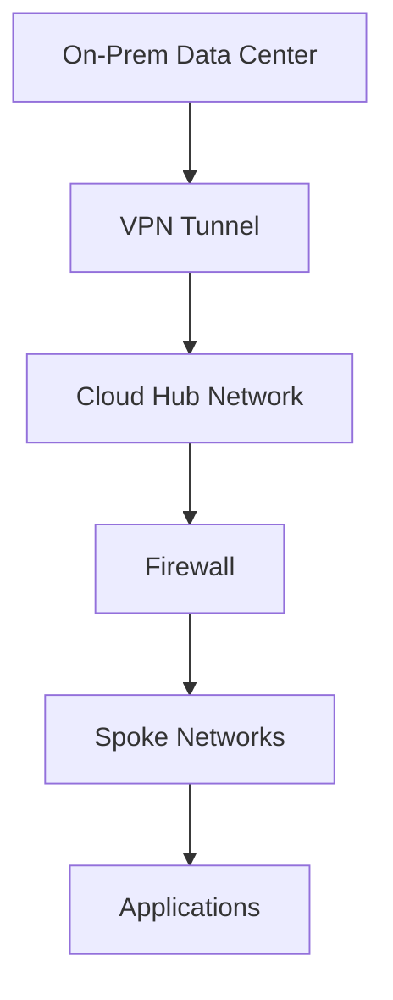

# 📘 Day 05 — Hybrid Connectivity (VPN, ExpressRoute, Direct Connect)

---

## 🎯 Objective

Design and simulate **hybrid connectivity** between on-premises and multi-cloud environments using secure tunnels and enterprise connectivity models.

By the end of this lab, you will:
- Understand hybrid networking concepts
- Design VPN-based connectivity
- Simulate Azure, AWS, and GCP hybrid connections
- Learn enterprise-grade connectivity (ExpressRoute, Direct Connect, Interconnect)
- Understand routing and failover patterns

---

## 🧠 Concept (Think Like an Architect)

### 🌉 Analogy: Connecting Cities with Secure Highways

- On-Prem = Headquarters City
- Cloud = Remote City
- VPN = Encrypted tunnel (public highway with armored vehicles)
- ExpressRoute / Direct Connect = Private highway
- Routing = Traffic directions
- Firewall = Border control checkpoint

👉 Hybrid connectivity = **securely extending your network beyond your physical data center**

---

## 🏗️ Architecture

---

## 🧱 Lab Design
| Component | CIDR |
|-----------|-------|
| On-Prem Network | 192.168.0.0/16 |
| Azure Hub | 10.0.0.0/16 |
| AWS Hub | 10.10.0.0/16 |
| GCP Hub | 10.20.0.0/16 |

---

## 🧠 Types of Hybrid Connectivity
| Type | Description |
|-----------|-------|
| Site-to-Site VPN | Network-to-network tunnel |
| Point-to-Site VPN | User-to-network |
| ExpressRoute (Azure) | Private dedicated connection |
| Direct Connect (AWS) | Private dedicated connection |
| Interconnect (GCP) | Private dedicated connection |

---

### 🧪 Lab Step 1 — Simulate On-Prem Network

We simulate on-prem using a local CIDR:

192.168.0.0/16

### 🌐 Lab Step 2 — Azure VPN Gateway (Concept + CLI)
az network public-ip create \
  --name vpn-pip \
  --resource-group clab-network-rg \
  --sku Standard

az network vnet-gateway create \
  --name clab-vpn-gateway \
  --resource-group clab-network-rg \
  --vnet hub-vnet \
  --gateway-type Vpn \
  --vpn-type RouteBased \
  --sku VpnGw1 \
  --public-ip-address vpn-pip

### 🔗 Create Local Network Gateway (On-Prem)
az network local-gateway create \
  --name onprem-gateway \
  --resource-group clab-network-rg \
  --gateway-ip-address <ONPREM_PUBLIC_IP> \
  --local-address-prefixes 192.168.0.0/16

### 🔐 Create VPN Connection
az network vpn-connection create \
  --name clab-vpn-connection \
  --resource-group clab-network-rg \
  --vnet-gateway1 clab-vpn-gateway \
  --local-gateway2 onprem-gateway \
  --shared-key MySecureKey123

### 🧪 Lab Step 3 — AWS Site-to-Site VPN (Concept)
Key Components:

— Virtual Private Gateway (VGW)

— Customer Gateway

— VPN Connection

aws ec2 create-vpn-gateway \
  --type ipsec.1

aws ec2 create-customer-gateway \
  --type ipsec.1 \
  --public-ip <ONPREM_PUBLIC_IP> \
  --bgp-asn 65000

aws ec2 create-vpn-connection \
  --type ipsec.1 \
  --customer-gateway-id <CGW_ID> \
  --vpn-gateway-id <VGW_ID>

### 🧪 Lab Step 4 — GCP Cloud VPN (Concept)
gcloud compute vpn-gateways create clab-vpn-gateway \
  --network hub-vpc \
  --region us-central1

gcloud compute vpn-tunnels create clab-tunnel \
  --peer-address <ONPREM_PUBLIC_IP> \
  --shared-secret MySecureKey123 \
  --region us-central1 \
  --vpn-gateway clab-vpn-gateway

### 🧠 Key Concept — Routing in Hybrid

Traffic must know where to go:

On-Prem → Cloud → Spoke → Application
Cloud → On-Prem → Data Center

### 🔥 Enterprise Connectivity (VERY IMPORTANT)
| Cloud | Private Connectivity |
|-----------|-------|
| Azure | ExpressRoute |
| AWS | Direct Connect |
| GCP | Interconnect |

👉 Used for:

High bandwidth

Low latency

Compliance requirements

### 🧪 Lab Step 5 — Simulate Routing Flow

### 🚨 Key Concept — Failover

Enterprise design includes:

Primary: ExpressRoute / Direct Connect

Backup: VPN

👉 Always design redundancy

### 🧪 Lab Step 6 — Validation

Check Azure:

az network vpn-connection show \
  --name clab-vpn-connection \
  --resource-group clab-network-rg

Check AWS:

aws ec2 describe-vpn-connections

Check GCP:

gcloud compute vpn-tunnels list

---

### 🚨 Troubleshooting
- VPN not connecting
- Check shared key
- Check IP mismatch
- Check routing tables
- No traffic flow
- Verify route propagation
- Check firewall rules
- Check CIDR overlap

---

### ✅ Validation Checklist

- On-prem network defined
- Azure VPN configured
- AWS VPN configured
- GCP VPN configured
- Routing understood
- Failover concept understood

---

### 🎯 Key Takeaways

- Hybrid = extending enterprise network securely
- VPN = encrypted tunnel over internet
- Dedicated circuits = enterprise-grade connectivity
- Routing = most critical component
- Redundancy = mandatory in real environments

---

### 🚀 Next Step

➡️ Day 06 — Load Balancers & Application Protection

You will:

- Deploy Azure Application Gateway
- Configure AWS ALB/NLB
- Implement GCP Load Balancing
- Add WAF protection
