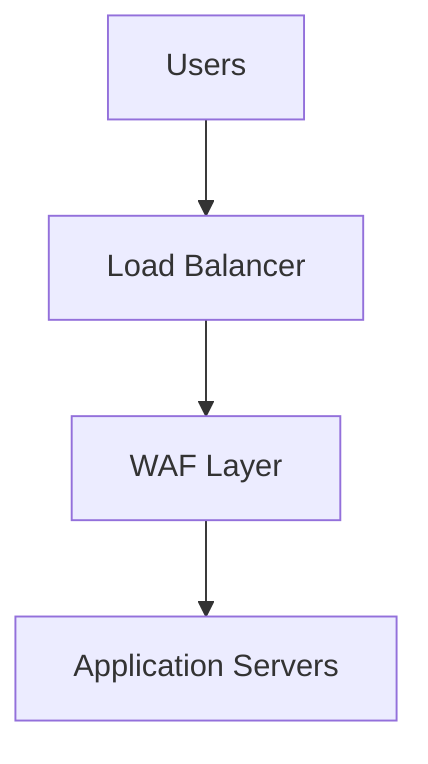

# 📘 Day 06 — Load Balancers & Application Protection

---

## 🎯 Objective

Design and deploy **load balancers across Azure, AWS, and GCP**, and implement **application-layer protection (WAF)**.

By the end of this lab, you will:
- Understand L4 vs L7 load balancing
- Deploy Azure Application Gateway
- Deploy AWS ALB/NLB
- Understand GCP Load Balancing
- Implement WAF protection
- Secure application traffic paths

---

## 🧠 Concept (Think Like an Architect)

### 🚦 Analogy: Smart Traffic Control System

- Load Balancer = Traffic controller at intersection
- Backend Servers = Roads
- Users = Cars
- WAF = Security checkpoint inspecting vehicles

👉 Without a load balancer → traffic chaos  
👉 Without WAF → vulnerable to attacks

---

## 🏗️ Architecture

---

## 🧠 Key Concepts
L4 vs L7
| Type | Description |
|-----------|-------|
| L4 (Transport) | Routes based on IP/Port |
| L7 (Application) | Routes based on URL/Headers |

👉 Example:

/api → backend1

/web → backend2

---

### 🧪 Lab Step 1 — Azure Application Gateway (L7 + WAF)
Create Public IP
az network public-ip create \
  --resource-group clab-network-rg \
  --name appgw-pip \
  --sku Standard

Create Application Gateway
az network application-gateway create \
  --name clab-appgw \
  --location eastus \
  --resource-group clab-network-rg \
  --vnet-name hub-vnet \
  --subnet default \
  --public-ip-address appgw-pip \
  --sku WAF_v2 \
  --capacity 2

Enable WAF Mode
az network application-gateway waf-config set \
  --gateway-name clab-appgw \
  --resource-group clab-network-rg \
  --enabled true \
  --firewall-mode Prevention

### 🧪 Lab Step 2 — AWS Load Balancers
Create ALB (L7)
aws elbv2 create-load-balancer \
  --name clab-alb \
  --subnets <SUBNET_ID_1> <SUBNET_ID_2>

Create Target Group
aws elbv2 create-target-group \
  --name clab-tg \
  --protocol HTTP \
  --port 80 \
  --vpc-id <VPC_ID>

Create Listener
aws elbv2 create-listener \
  --load-balancer-arn <ALB_ARN> \
  --protocol HTTP \
  --port 80 \
  --default-actions Type=forward,TargetGroupArn=<TG_ARN>

AWS WAF (Concept)

Attach WAF to ALB:

AWS WAF Web ACL

Associate with ALB

### 🧪 Lab Step 3 — AWS NLB (L4)
aws elbv2 create-load-balancer \
  --name clab-nlb \
  --type network \
  --subnets <SUBNET_ID>

### 🧪 Lab Step 4 — GCP Load Balancer
Concept:

Global HTTP(S) Load Balancer

Backend service

Instance group

Create Backend Instance
gcloud compute instances create web-server \
  --zone us-central1-a \
  --machine-type e2-micro

Create Backend Service
gcloud compute backend-services create clab-backend \
  --global \
  --protocol HTTP

### 🛡️ Cloud Armor (WAF)

Attach Cloud Armor policy to backend service.

---

### 🧠 Key Concept — Application Security Layers
| Layer | Protection |
|-----------|-------|
| L3/L4 | Firewall |
| L7 | WAF |
| App | Authentication |

👉 Defense in depth.

---

### 🔥 Multi-Cloud Comparison
| Feature | Azure | AWS | GCP |
|-----------|-------|-------|-------|
| L7 LB | App Gateway | ALB | HTTP LB |
| L4 LB | Load Balancer | NLB | TCP LB |
| WAF | Built-in | AWS WAF | Cloud Armor |

---

### 🧪 Lab Step 5 — Test Traffic Flow

Test from browser:

http://<LOAD_BALANCER_IP>

---

## 🚨 Common Attacks WAF Blocks

SQL Injection

Cross-Site Scripting (XSS)

OWASP Top 10

---

## 🚨 Troubleshooting
- LB not responding
- Check backend health
- Check NSG / Security Groups
- WAF blocking traffic
- Review rules
- Switch to detection mode
- Backend unhealthy
- Check health probes
- Check ports

---

## ✅ Validation Checklist

- Azure App Gateway deployed
- WAF enabled
- AWS ALB created
- AWS NLB created
- GCP LB configured
- Traffic flows correctly
- WAF protection understood

---

## 🎯 Key Takeaways

- Load balancers control traffic distribution
- WAF protects application layer
- L7 = intelligent routing
- Defense-in-depth is critical
- Multi-cloud implementations differ but follow same principles

---

## 🚀 Next Step

➡️ Day 07 — Vendor Firewalls (Palo Alto, Check Point)

You will:

- Integrate enterprise firewalls
- Understand Panorama / centralized control
- Compare vendor vs cloud-native security
