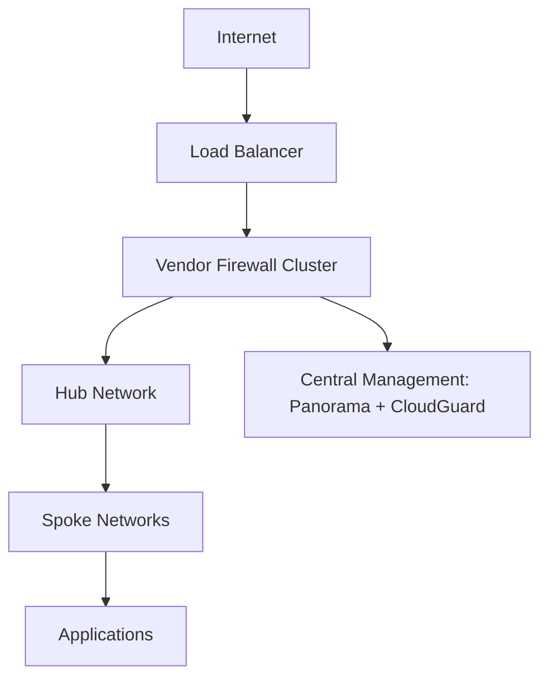
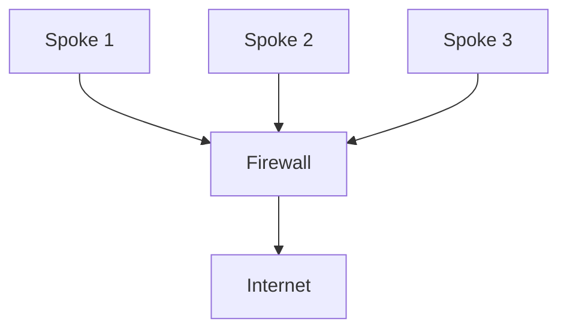

# 📘 Day 07 — Vendor Firewalls (Palo Alto & Check Point)

---

## 🎯 Objective

Understand and design **enterprise firewall architectures** using:
- Palo Alto VM-Series (Panorama, Prisma concepts)
- Check Point CloudGuard

By the end of this lab, you will:
- Understand vendor firewalls vs cloud-native firewalls
- Design centralized firewall architectures
- Learn policy management at scale
- Understand enterprise inspection patterns
- Map real-world Deloitte-style deployments

---

## 🧠 Concept (Think Like an Architect)

### 🛡️ Analogy: Airport Security Command Center

- Firewall = Security officer
- Panorama / Management = Security command center
- Policies = Rules of entry
- Traffic = Passengers

👉 Cloud-native firewall = basic checkpoint  
👉 Vendor firewall = **full security intelligence system**

---

## 🏗️ Architecture

---

## 🧠 Why Vendor Firewalls?

Cloud-native firewalls are good, but enterprises need:

| Feature | Native | Vendor |
|-----------|-------|-------|
| Deep packet inspection | Limited | Advanced |
| Threat intelligence | Basic | Advanced |
| Central policy control | Limited | Strong |
| App-level visibility | Limited | Full |
| Zero Trust enforcement | Partial | Full |

👉 This is why Deloitte uses Palo Alto / Check Point

---

## 🔥 Palo Alto VM-Series
Components:
VM-Series Firewall
Panorama (central management)
Prisma (cloud security platform)

### 🧪 Lab Step 1 — Deployment Concept

In Azure or AWS:

Deploy VM-Series firewall in hub network
Route traffic through firewall
Use Panorama for centralized control

### 🧠 Traffic Flow
User → Load Balancer → Palo Alto Firewall → Application

### 🔐 Example Policy
Allow:
- Source: Spoke Subnets
- Destination: Internet
- App: HTTPS
- Action: Allow

Deny:
- Unknown applications
- Suspicious traffic

### 🧠 Key Concept — App-ID (Palo Alto)

Unlike traditional firewalls:

👉 Palo Alto identifies applications, not just ports

Example:

Port 443 ≠ always HTTPS
Firewall detects actual application behavior

### 🔥 Check Point CloudGuard
Components:
CloudGuard Gateway
SmartConsole (management)
Security policies

### 🧪 Lab Step 2 — CloudGuard Deployment Concept
Deploy CloudGuard in hub VPC/VNet
Route all traffic through it
Manage via SmartConsole

### 🧠 Policy Example
Allow:
- Trusted subnets
- Known services

Block:
- Malicious IPs
- Unauthorized ports
- Threat signatures

### 🧠 Key Concept — Threat Prevention

Vendor firewalls provide:

Intrusion Prevention (IPS)
Anti-malware
URL filtering
DNS security

👉 This is beyond basic firewall rules

---

## 🔥 Centralized Firewall Pattern

👉 All traffic is forced through firewall

---

### 🧠 Important Concept — East-West vs North-South
| Traffic Type | Description |
|-----------|-------|
| North-South | Internet ↔ Cloud |
| East-West | Between workloads |

👉 Vendor firewalls inspect BOTH

### 🧪 Lab Step 3 — Routing Integration

You already did this earlier:

Azure → UDR to firewall
AWS → TGW + inspection VPC
GCP → routing + firewall rules

👉 Replace native firewall with vendor firewall

---

### 🧠 Real Enterprise Design (Deloitte Style)
Hub contains:
Firewall cluster
Load balancer
VPN gateways

Spokes contain:
Applications

Centralized logging:
SIEM (Sentinel, Splunk)

### 🔥 Vendor vs Cloud-Native Summary
| Feature | Azure Firewall | Palo Alto | Check Point |
|-----------|-------|-------|-------|
| Ease of use | High | Medium | Medium |
| Security depth | Medium | High | High |
| Cost | Lower | Higher | Higher |
| Control | Moderate | Full | Full |

---

### 🧪 Lab Step 4 — Simulate Policy Thinking

Think like this:

IF traffic == trusted AND app == HTTPS
THEN allow

ELSE inspect

IF threat detected
THEN block + log

---

## 🚨 Troubleshooting
- Traffic not flowing
- Check routing
- Check firewall rules
- Check NAT
- Firewall blocking legitimate traffic
- Review policy order
- Check logs
- High latency
- Check inspection overhead
- Scale firewall instances

---

## ✅ Validation Checklist
- Understand vendor firewall role
- Understand centralized architecture
- Understand policy management
- Understand App-ID concept
- Understand threat prevention
- Understand routing integration

---
 
## 🎯 Key Takeaways
- Vendor firewalls = enterprise-grade security
- Centralized control is critical
- Policy design is more important than deployment
- Traffic inspection must be enforced
- Cloud-native ≠ enough for enterprise

---

## 🚀 Next Step

➡️ Day 08 — Terraform Multi-Cloud Modules

You will:

- Build reusable infrastructure
- Automate deployments
- Standardize multi-cloud environments
