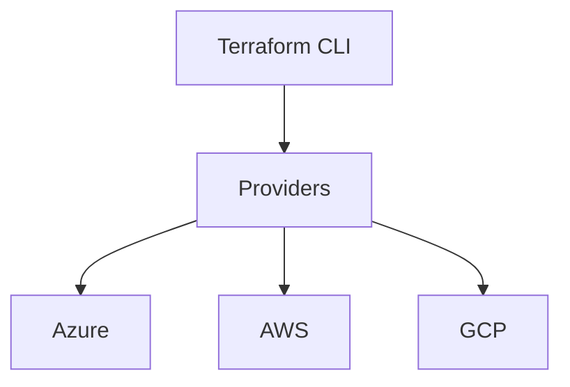

# 📘 Day 08 — Terraform Multi-Cloud Modules

---

## 🎯 Objective

Design and implement **multi-cloud infrastructure using Terraform**, with reusable modules for Azure, AWS, and GCP.

By the end of this lab, you will:
- Understand Terraform core concepts
- Build reusable modules
- Deploy infrastructure across clouds
- Structure production-ready IaC
- Apply best practices for DevSecOps

---

## 🧠 Concept (Think Like an Architect)

### 🏗️ Analogy: Blueprint Factory

- Terraform = Blueprint system
- Modules = Reusable building designs
- Variables = Custom inputs
- State = Construction record

👉 Instead of building manually, you **automate and standardize everything**

---

## 🧠 Key Concepts

| Concept | Description |
|--------|------------|
| Provider | Cloud platform (Azure, AWS, GCP) |
| Resource | Infrastructure object |
| Module | Reusable code block |
| State | Tracks deployed resources |
| Variables | Input values |
| Outputs | Export values |

---

## 🏗️ Architecture



---

## 🧱 Project Structure
```
terraform/
├── main.tf
├── variables.tf
├── outputs.tf
├── terraform.tfvars
├── providers.tf
└── modules/
    ├── azure-network/
    ├── aws-network/
    └── gcp-network/
```

---

### 🧪 Lab Step 1 — Create Terraform Directory
mkdir -p terraform/modules/azure-network \
terraform/modules/aws-network \
terraform/modules/gcp-network

cd terraform

### 🧪 Lab Step 2 — Create Providers
nano providers.tf

Paste:

provider "azurerm" {
  features {}
}

provider "aws" {
  region = "us-east-1"
}

provider "google" {
  project = "<YOUR_PROJECT_ID>"
  region  = "us-central1"
}

### 🧪 Lab Step 3 — Create Azure Module
nano modules/azure-network/main.tf

resource "azurerm_resource_group" "rg" {
  name     = "clab-tf-rg"
  location = "East US"
}

resource "azurerm_virtual_network" "vnet" {
  name                = "clab-vnet"
  address_space       = ["10.0.0.0/16"]
  location            = azurerm_resource_group.rg.location
  resource_group_name = azurerm_resource_group.rg.name
}

### 🧪 Lab Step 4 — Create AWS Module
nano modules/aws-network/main.tf

resource "aws_vpc" "vpc" {
  cidr_block = "10.10.0.0/16"
}

### 🧪 Lab Step 5 — Create GCP Module
nano modules/gcp-network/main.tf

resource "google_compute_network" "vpc" {
  name                    = "clab-gcp-vpc"
  auto_create_subnetworks = false
}

### 🧪 Lab Step 6 — Root Module
nano main.tf

module "azure_network" {
  source = "./modules/azure-network"
}

module "aws_network" {
  source = "./modules/aws-network"
}

module "gcp_network" {
  source = "./modules/gcp-network"
}

### 🧪 Lab Step 7 — Initialize Terraform
terraform init

### 🧪 Lab Step 8 — Plan Deployment
terraform plan

### 🧪 Lab Step 9 — Apply
terraform apply

Type:

yes

### 🧠 Key Concept — State Management

Terraform keeps track of infrastructure using:

terraform.tfstate

👉 This is critical — never lose state in production

### 🔥 Best Practice — Remote State (Concept)

Use:

Azure Storage Account
AWS S3 + DynamoDB
GCP Storage

👉 Prevents state loss and enables team collaboration

### 🧠 Module Reusability

Instead of rewriting:

resource "aws_vpc" ...

You reuse:

module "network"

👉 This is enterprise automation

### 🧪 Lab Step 10 — Destroy Resources
terraform destroy

👉 Always clean up to avoid cost

---

## 🚨 Troubleshooting
Terraform init fails:
Check provider versions
Check internet connectivity

Auth errors:
Verify Azure CLI login
Verify AWS credentials
Verify GCP auth

Plan fails:
Check syntax
Validate variables

---

## ✅ Validation Checklist

- Terraform initialized
- Modules created
- Multi-cloud deployment works
- Plan successful
- Apply successful
- Destroy tested

---

## 🎯 Key Takeaways

- Terraform = automation engine
- Modules = reusable architecture
- State = source of truth
- Multi-cloud = unified deployment
- IaC = required for modern engineering

---

## 🚀 Next Step

➡️ Day 09 — CI/CD (GitHub Actions + Azure DevOps)

You will:

- Automate Terraform deployments
- Build pipelines
- Integrate security into CI/CD
