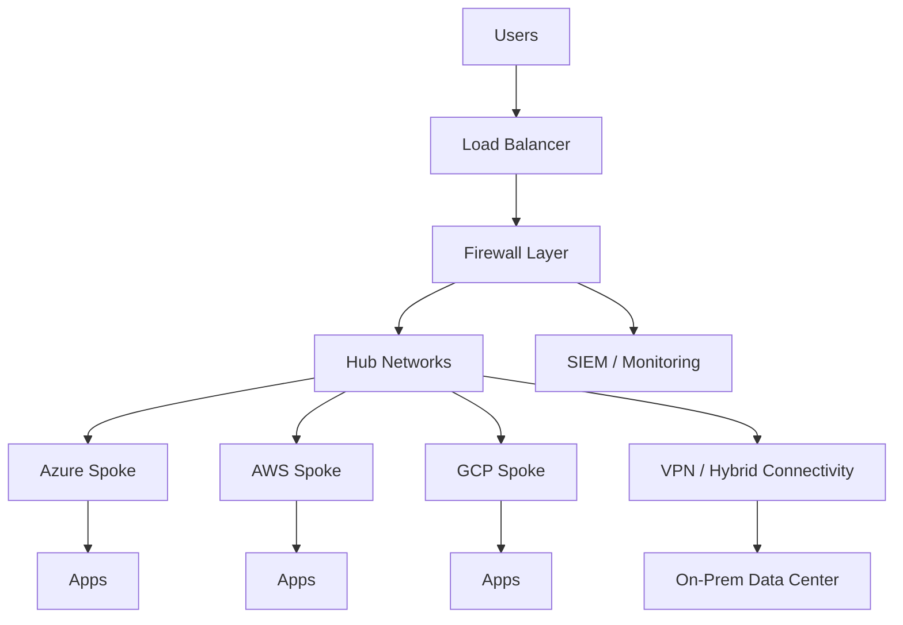
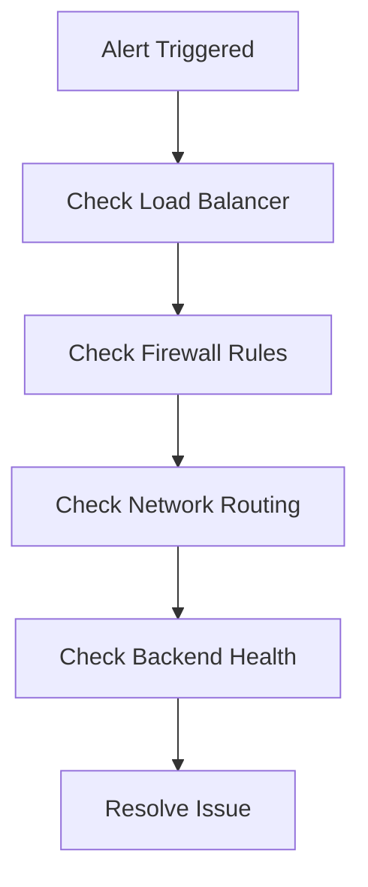
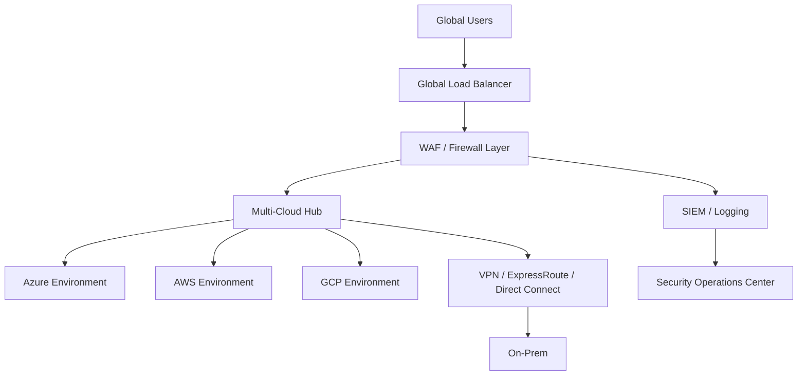

- Design a full multi-cloud architecture
- Present your solution like a consultant

---

## 🧠 Concept (Think Like a Senior Engineer)

### 🚑 Analogy: Emergency Response System

- Monitoring = Security cameras
- Alerts = Emergency calls
- Engineers = First responders
- Runbooks = Emergency procedures
- Fix = Restore service safely

👉 Deployment is only 50% of the job  
👉 Operations and response = the other 50%

---

## 🏗️ Full Multi-Cloud Architecture

---

## 🧠 Operations Model
| Area | Responsibility |
|-----------|-------|
| Monitoring | Detect issues |
| Alerting | Notify engineers |
| Response | Fix issues |
| Logging | Record activity |
| Automation | Reduce manual work |

---

### 🧪 Lab Step 1 — Monitoring Strategy
Tools:
Azure → Monitor / Sentinel
AWS → CloudWatch
GCP → Cloud Logging

### 🧠 Key Concept — Observability

You need visibility into:

Logs + Metrics + Traces

### 🧪 Lab Step 2 — Simulated Incident
Scenario:

🚨 Web application is down

### 🧠 Investigation Flow

---
    
### 🧪 Lab Step 3 — Troubleshooting Commands
Azure:
- az network watcher flow-log show
- az vm list-ip-addresses

AWS:
- aws ec2 describe-instances
- aws ec2 describe-route-tables

GCP:
- gcloud compute instances list
- gcloud compute firewall-rules list

### 🧠 Key Concept — Root Cause Analysis (RCA)

Ask:

1. What failed?
2. Why did it fail?
3. How do we prevent it?

### 🧪 Lab Step 4 — Build Runbook
nano docs/runbooks/incident-response.md

Example Runbook
# Incident Response Runbook

## Issue: Application Down

### Steps:
1. Check load balancer health
2. Verify firewall rules
3. Validate routing tables
4. Check VM status
5. Review logs

### Resolution:
- Fix misconfigured route
- Restart service
- Update firewall rule

### 🧠 Key Concept — Automation in Ops

Automate:

- Alerts
- Scaling
- Recovery

👉 Reduce manual intervention

### 🧪 Lab Step 5 — Capstone Design
Requirements:

Design a system for:

- Global enterprise
- Multi-cloud (Azure, AWS, GCP)
- Secure network architecture
- Hybrid connectivity
- Centralized firewall
- Load balancing
- CI/CD automation

### 🧠 Capstone Architecture

---

### 🧪 Lab Step 6 — Document Capstone
nano docs/architecture/capstone.md

Include:

- Architecture diagram
- Security layers
- Traffic flow
- Design decisions

### 🧠 Interview Tip (VERY IMPORTANT)

Explain your project like this:

👉 “I designed a multi-cloud hub-and-spoke architecture with centralized firewall inspection, hybrid connectivity, Terraform automation, and CI/CD pipelines, aligned to enterprise security best practices.”

## 🚨 Common Real-World Issues
| Issue | Cause |
|-----------|-------|
| App down | LB misconfig |
| No connectivity | Route issue |
| Traffic blocked | Firewall rule |
| Slow performance | Inspection overhead |

---

## ✅ Final Validation Checklist
- Multi-cloud architecture understood
- Monitoring strategy defined
- Incident response process created
- Runbook documented
- Capstone architecture designed
- Repo fully updated

---

## 🎯 Final Takeaways
- Cloud engineering = build + operate
- Security = layered approach
- Automation = required
- Documentation = critical
- Troubleshooting = core skill

---

## 🎓 Course Complete

You now have:

- Multi-cloud architecture skills
- Network security expertise
- Terraform automation experience
- CI/CD knowledge
- Incident response capability

👉 This is real-world Cloud Network & Security Engineering

---

🚀 What This Means for You

You can now confidently say:

- “I’ve built and operated a multi-cloud security environment”
- “I understand enterprise networking patterns”
- “I can automate and secure infrastructure”
